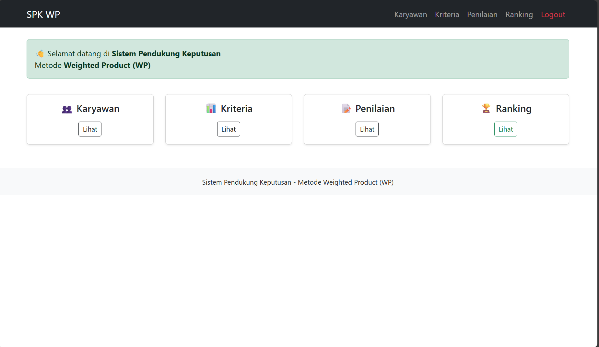
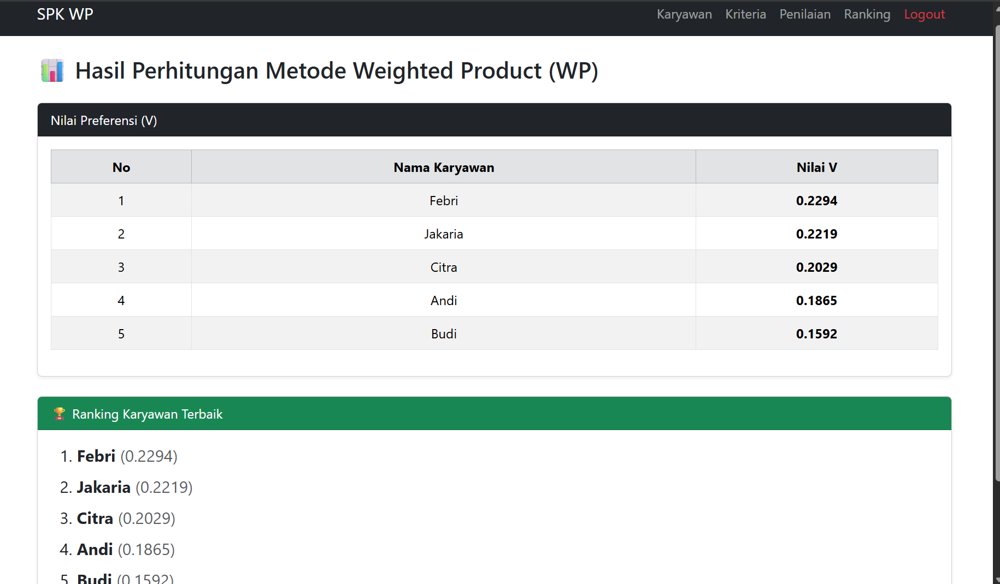

# 📦 REPOSITORY DOCUMENTATION

## Sistem Pendukung Keputusan (SPK)

### Penilaian Karyawan Terbaik

**Metode: Weighted Product (WP)**


## 📌 Deskripsi Proyek

Project ini merupakan **aplikasi web Sistem Pendukung Keputusan (SPK)** untuk menentukan **karyawan terbaik** menggunakan metode **Weighted Product (WP)**.

Aplikasi dibangun menggunakan **PHP, MySQL, dan Bootstrap 5**, dilengkapi fitur **CRUD, pencarian data, dan perhitungan WP otomatis**.

---

## 🛠️ Teknologi yang Digunakan

- PHP (Native)
- MySQL
- Bootstrap 5 (CDN)
- Apache (XAMPP)
- VS Code

---

## 📂 Struktur Folder Project

```
spk_wp/
│
├── assets/
│   ├── header.php
│   └── footer.php
│
├── auth/
│   ├── login.php
│   ├── proses_login.php
│   └── logout.php
│
├── config/
│   └── koneksi.php
│
├── pages/
│   ├── karyawan.php
│   ├── karyawan_tambah.php
│   ├── karyawan_edit.php
│   ├── karyawan_hapus.php
│   ├── kriteria.php
│   ├── kriteria_tambah.php
│   ├── kriteria_edit.php
│   ├── kriteria_hapus.php
│   ├── penilaian.php
│   ├── penilaian_tambah.php
│   ├── penilaian_edit.php
│   ├── penilaian_hapus.php
│   ├── perhitungan_wp.php
│   └── hasil.php
│
├── dashboard.php
└── index.php

```

---

## 🗄️ Database & Query SQL

### 1️⃣ Membuat Database

```sql
CREATE DATABASE spk_wp;
USE spk_wp;

```

---

### 2️⃣ Tabel `karyawan`

```sql
CREATE TABLE karyawan (
    id_karyawan INT AUTO_INCREMENT PRIMARY KEY,
    nama_karyawan VARCHAR(100)
);

```

---

### 3️⃣ Tabel `kriteria`

```sql
CREATE TABLE kriteria (
    id_kriteria INT AUTO_INCREMENT PRIMARY KEY,
    kode_kriteria VARCHAR(5),
    nama_kriteria VARCHAR(100),
    bobot DOUBLE,
    jenis ENUM('benefit','cost')
);

```

---

### 4️⃣ Tabel `penilaian`

```sql
CREATE TABLE penilaian (
    id_penilaian INT AUTO_INCREMENT PRIMARY KEY,
    id_karyawan INT,
    id_kriteria INT,
    nilai INT,
    FOREIGN KEY (id_karyawan) REFERENCES karyawan(id_karyawan)
        ON DELETE CASCADE,
    FOREIGN KEY (id_kriteria) REFERENCES kriteria(id_kriteria)
        ON DELETE CASCADE
);

```

---

## 🔗 Koneksi Database

📄 `config/koneksi.php`

```php
<?php
$koneksi = mysqli_connect("localhost","root","","spk_wp");
if(!$koneksi){
    die("Koneksi gagal");
}
?>

```

---

## 🧮 Implementasi Metode Weighted Product

📄 `pages/perhitungan_wp.php`

(**Hanya LOGIKA, tanpa HTML**)

```php
<?php
include "../config/koneksi.php";

$query = mysqli_query($koneksi,"
    SELECT p.id_karyawan, k.nama_karyawan,
           kr.id_kriteria, kr.bobot, kr.jenis, p.nilai
    FROM penilaian p
    JOIN karyawan k ON p.id_karyawan = k.id_karyawan
    JOIN kriteria kr ON p.id_kriteria = kr.id_kriteria
");

$data = [];
while($r = mysqli_fetch_assoc($query)){
    $id = $r['id_karyawan'];
    $data[$id]['nama'] = $r['nama_karyawan'];
    $data[$id]['nilai'][$r['id_kriteria']] = [
        'nilai' => $r['nilai'],
        'bobot' => $r['bobot'],
        'jenis' => $r['jenis']
    ];
}

$S = [];
foreach($data as $id => $d){
    $S[$id] = 1;
    foreach($d['nilai'] as $k){
        $bobot = ($k['jenis']=='cost') ? -$k['bobot'] : $k['bobot'];
        $S[$id] *= pow($k['nilai'], $bobot);
    }
}

$totalS = array_sum($S);
$V = [];
foreach($S as $id => $nilai){
    $V[$id] = $nilai / $totalS;
}

```

---

## 🏆 Hasil & Ranking

📄 `pages/hasil.php`

```php
include "perhitungan_wp.php";
arsort($V);

```

Hasil akhir berupa:

- Nilai preferensi (V)
- Ranking karyawan terbaik

---

## 🔄 CRUD Otomatis Penilaian

Saat menambah karyawan, sistem otomatis membuat penilaian default:

```php
$id_karyawan = mysqli_insert_id($koneksi);
$kriteria = mysqli_query($koneksi,"SELECT * FROM kriteria");

while($k = mysqli_fetch_assoc($kriteria)){
    mysqli_query($koneksi,"
      INSERT INTO penilaian VALUES
      (NULL,'$id_karyawan','$k[id_kriteria]',3)
    ");
}

```

📌 Nilai `3` = nilai awal (netral), dapat diubah admin.

---

## 🔍 Fitur Pencarian (Search)

Contoh pada data karyawan:

```php
$search = $_GET['search'] ?? '';
$data = mysqli_query($koneksi,"
    SELECT * FROM karyawan
    WHERE nama_karyawan LIKE '%$search%'
");

```

---

## 🔐 Login Admin (Sederhana)

```php
if($username=="admin" && $password=="admin123"){
    $_SESSION['login'] = true;
}

```

---

## 🚀 Cara Menjalankan Project

1. Clone repository
2. Import database ke phpMyAdmin
3. Jalankan Apache & MySQL
4. Akses:
    
    ```
    http://localhost/spk_wp
    
    ```

## 📸 Screenshot Aplikasi

### Halaman Login


### Dashboard


### Hasil Perhitungan


